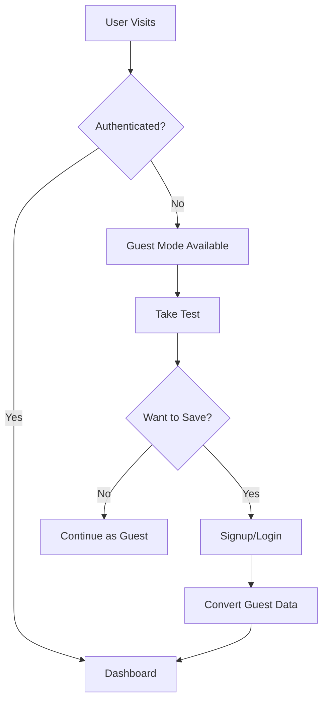

# 🚀 SplashEasy V2 - Phase 2 Development Plan

## 📊 **Current Status: Phase 1 MVP Complete**

**Phase 1 Achievements**:
- ✅ Functional AI water testing with GPT-4 Vision
- ✅ WebRTC camera interface with mobile optimization
- ✅ Professional results display with recommendations
- ✅ Anonymous guest testing (no registration required)
- ✅ Complete CI/CD pipeline and documentation
- ✅ Database schema ready for user data

**Demo URL**: https://splasheasy-v2-44a6wr80d-michael-coopers-projects-69eead79.vercel.app

---

## 🎯 **Phase 2 Goal: Production-Ready Application**

Transform the functional MVP into a full production application with user accounts, data persistence, and enhanced user experience.

### **Phase 2 Success Criteria**
- Users can create accounts and log in
- Test results are saved and accessible in history
- Users can manage multiple pools/spas
- Maintenance reminders system operational
- Enhanced mobile experience with PWA features

---

## 📋 **Phase 2 Development Roadmap**

### **🔐 Epic 1: User Authentication & Accounts**
**Priority**: HIGH (Foundation for all other features)

#### **User Stories**
- As a user, I want to create an account so I can save my test results
- As a user, I want to log in to access my saved data
- As a user, I want to continue using the app without an account (guest mode)
- As a user, I want to convert my guest session to a full account

#### **Technical Tasks**
- [ ] **Auth Components** - Login/Signup forms with Supabase Auth
- [ ] **Navigation Updates** - Add auth state to navigation
- [ ] **Protected Routes** - Middleware for authenticated areas  
- [ ] **User Profile** - Basic profile management
- [ ] **Session Management** - Handle auth state across app
- [ ] **Guest-to-User Migration** - Convert guest sessions to accounts

#### **Files to Create/Modify**
```
app/auth/
├── login/page.tsx                 # Login page
├── signup/page.tsx               # Signup page  
├── callback/page.tsx             # OAuth callback handler
└── profile/page.tsx              # User profile management

components/auth/
├── LoginForm.tsx                 # Login form component
├── SignupForm.tsx               # Signup form component
├── AuthButton.tsx               # Login/logout button
└── ProtectedRoute.tsx           # Route protection wrapper

lib/auth/
├── auth-client.ts               # Client-side auth utilities
├── auth-server.ts               # Server-side auth utilities  
└── middleware.ts                # Auth middleware
```

---

### **📊 Epic 2: Test Result Persistence & History**
**Priority**: HIGH (Core user value)

#### **User Stories**  
- As a user, I want my test results saved so I can track changes over time
- As a user, I want to see trends in my water chemistry
- As a user, I want to view detailed history of all my tests
- As a user, I want to export or share my test data

#### **Technical Tasks**
- [ ] **Save Test Results** - Store results in Supabase after analysis
- [ ] **Test History Page** - Display user's test history with filters
- [ ] **Trend Analysis** - Charts showing chemical levels over time
- [ ] **Result Details** - Individual test result detail view
- [ ] **Data Export** - Export history as PDF or CSV

#### **Files to Create/Modify**
```
app/dashboard/
├── page.tsx                     # Main dashboard
├── history/page.tsx             # Test history page
├── trends/page.tsx              # Trend analysis page
└── test/[id]/page.tsx          # Individual test details

components/dashboard/
├── TestHistory.tsx              # History table/list
├── TrendChart.tsx               # Chart components
├── QuickStats.tsx               # Dashboard summary stats
└── TestResultCard.tsx           # Result display card

lib/database/
├── test-queries.ts              # Test result database queries
└── analytics.ts                 # Data analysis utilities
```

---

### **🏊‍♀️ Epic 3: Unit Management (Pools & Spas)**
**Priority**: MEDIUM (Enables personalized recommendations)

#### **User Stories**
- As a user, I want to add and manage multiple pools/spas
- As a user, I want personalized recommendations based on my pool size/type
- As a user, I want to associate test results with specific pools
- As a user, I want to set default settings for each unit

#### **Technical Tasks**
- [ ] **Unit CRUD Operations** - Add/edit/delete pools and spas
- [ ] **Unit Selection** - Choose unit during testing flow
- [ ] **Unit-Specific Settings** - Volume, type, sanitizer preferences
- [ ] **Personalized Dosing** - Calculate chemicals based on unit specs
- [ ] **Unit Dashboard** - Per-unit analytics and history

#### **Files to Create/Modify**
```
app/units/
├── page.tsx                     # Units list page
├── add/page.tsx                 # Add new unit form
├── [id]/edit/page.tsx          # Edit unit form  
└── [id]/page.tsx               # Unit details and history

components/units/
├── UnitCard.tsx                 # Unit display card
├── UnitForm.tsx                 # Add/edit unit form
├── UnitSelector.tsx             # Choose unit during testing
└── UnitStats.tsx                # Unit-specific statistics

lib/database/
└── unit-queries.ts              # Unit management queries
```

---

### **📅 Epic 4: Maintenance Reminder System**
**Priority**: MEDIUM (Adds ongoing value)

#### **User Stories**
- As a user, I want reminders for regular maintenance tasks
- As a user, I want to customize reminder frequency
- As a user, I want to mark tasks as complete
- As a user, I want seasonal maintenance suggestions

#### **Technical Tasks**
- [ ] **Reminder CRUD** - Create/manage maintenance reminders
- [ ] **Notification System** - Email/browser notifications
- [ ] **Task Completion** - Mark tasks complete and reschedule
- [ ] **Smart Suggestions** - AI-powered maintenance recommendations
- [ ] **Calendar Integration** - Export to calendar apps

---

### **📱 Epic 5: Enhanced Mobile & PWA Features**
**Priority**: LOW (Polish and user experience)

#### **User Stories**
- As a user, I want to install the app on my phone
- As a user, I want offline access to my test history
- As a user, I want push notifications for reminders
- As a user, I want camera optimization for different devices

---

## 🛠️ **Phase 2 Technical Architecture**

### **Authentication Flow**


### **Data Persistence Strategy**
- **Guest Users**: Results stored in localStorage temporarily
- **Authenticated Users**: All data persisted to Supabase
- **Migration**: Guest data converted on account creation
- **Backup**: Regular automated backups of user data

### **Database Usage**
The existing schema is ready for Phase 2:
- `profiles` table for user accounts
- `units` table for pools/spas  
- `water_tests` table for test results
- `maintenance_reminders` table for reminders

---

## 📈 **Development Priorities & Timeline**

### **Sprint 1 (Week 1-2): Authentication Foundation**
1. Set up Supabase Auth integration
2. Create login/signup pages
3. Add auth state management
4. Implement protected routes
5. Test authentication flow

### **Sprint 2 (Week 3-4): Test Result Persistence** 
1. Connect test results to database
2. Build test history page
3. Add user dashboard
4. Implement guest-to-user migration
5. Test data persistence

### **Sprint 3 (Week 5-6): Unit Management**
1. Create unit management pages
2. Add unit selection to test flow
3. Implement personalized dosing calculations
4. Build unit-specific dashboards
5. Test multi-unit functionality

### **Sprint 4 (Week 7-8): Maintenance & Polish**
1. Build maintenance reminder system
2. Add notification functionality
3. Enhance mobile experience
4. Performance optimization
5. User testing and feedback

---

## 🧪 **Testing Strategy**

### **Phase 2 Testing Requirements**
- **Authentication Testing**: Login/logout, session management
- **Data Testing**: CRUD operations for all entities
- **Integration Testing**: Guest-to-user conversion flow
- **Mobile Testing**: Responsive design and camera functionality
- **Performance Testing**: Database query optimization

### **User Acceptance Testing**
- Create test accounts and run through complete user journey
- Test guest mode to authenticated user conversion
- Verify test result storage and retrieval
- Test multi-unit management functionality

---

## 🔧 **Development Setup for Phase 2**

### **Required Environment Variables**
Already configured:
- `NEXT_PUBLIC_SUPABASE_URL`
- `NEXT_PUBLIC_SUPABASE_ANON_KEY`
- `SUPABASE_SERVICE_ROLE_KEY`
- `OPENAI_API_KEY`

### **Additional Dependencies Needed**
```bash
# Chart library for trends
npm install recharts

# Date handling for reminders  
npm install date-fns

# Email notifications
npm install @supabase/auth-helpers-nextjs
```

### **Database Migrations**
No additional migrations needed - existing schema supports Phase 2 features.

---

## 📊 **Success Metrics for Phase 2**

### **Technical Metrics**
- [ ] User registration and login flow working
- [ ] Test results successfully saved and retrieved
- [ ] Multi-unit management functional
- [ ] Maintenance reminders operational
- [ ] Mobile experience optimized

### **User Experience Metrics**
- [ ] Guest-to-user conversion flow intuitive
- [ ] Dashboard provides clear value
- [ ] Unit management is straightforward
- [ ] Maintenance reminders are helpful
- [ ] Overall app feels production-ready

---

## 🚀 **Phase 2 Completion Criteria**

Phase 2 will be considered complete when:

1. **User Authentication**: Users can create accounts, log in, and manage profiles
2. **Data Persistence**: All test results are saved and accessible in history
3. **Unit Management**: Users can add/manage multiple pools and spas
4. **Personalized Experience**: Recommendations based on unit specifications
5. **Maintenance System**: Reminders and task management operational
6. **Production Quality**: Performance, security, and UX meet production standards

**Target Completion**: 8 weeks from Phase 2 start date

---

## 📝 **Getting Started with Phase 2**

### **Immediate Next Steps**
1. **Review Current Implementation**: Understand Phase 1 codebase
2. **Set up Development Environment**: Ensure all tools are ready
3. **Create Development Branch**: `git checkout -b phase-2-development`
4. **Start with Authentication**: Begin with Epic 1 - User Authentication
5. **Follow CI/CD Process**: Use existing pipeline for safe development

### **Recommended Starting Point**
Begin with **Epic 1: User Authentication** as it's the foundation for all other Phase 2 features. The existing Supabase configuration makes this the logical first step.

**First Task**: Create login and signup forms using Supabase Auth integration.

---

**🎯 Phase 2 will transform SplashEasy V2 from a functional MVP into a production-ready application with full user management and data persistence!**