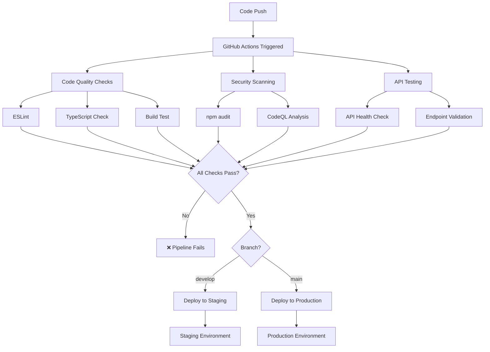

# SplashEasy V2 - CI/CD Pipeline Documentation

## 🚀 Overview

Comprehensive Continuous Integration and Continuous Deployment pipeline for SplashEasy V2 using GitHub Actions and Vercel.

## 🏗️ Pipeline Architecture



## 🔧 Pipeline Configuration

### **Workflow File**: `.github/workflows/ci.yml`

### **Triggers**

- **Push to main branch** → Production deployment
- **Push to develop branch** → Staging deployment
- **Pull requests to main** → Quality checks only
- **Scheduled runs** → Dependency updates

### **Jobs Overview**

| Job                  | Purpose                       | Runs On         |
| -------------------- | ----------------------------- | --------------- |
| `lint-and-typecheck` | Code quality validation       | All triggers    |
| `security-scan`      | Security vulnerability checks | All triggers    |
| `api-tests`          | API endpoint validation       | All triggers    |
| `deploy-staging`     | Staging deployment            | develop branch  |
| `deploy-production`  | Production deployment         | main branch     |
| `dependency-updates` | Automated dependency updates  | Weekly schedule |

## 📋 Quality Gates

### **1. Code Quality Checks**

- ✅ ESLint validation (no errors allowed)
- ✅ TypeScript type checking (strict mode)
- ✅ Successful build compilation
- ✅ Import/export validation

### **2. Security Scanning**

- ✅ npm audit (moderate+ vulnerabilities fail)
- ✅ CodeQL static analysis
- ✅ Dependency vulnerability scanning
- ✅ Secret detection

### **3. API Testing**

- ✅ Homepage loads successfully
- ✅ API health endpoint responds
- ✅ API validation works correctly
- ✅ Error handling verification

## 🌍 Deployment Environments

### **Staging Environment**

- **Trigger**: Push to `develop` branch
- **URL**: Auto-generated Vercel preview URL
- **Purpose**: Feature testing and validation
- **Environment**: `staging`

### **Production Environment**

- **Trigger**: Push to `main` branch
- **URL**: https://splasheasy-v2-44a6wr80d-michael-coopers-projects-69eead79.vercel.app
- **Purpose**: Live user-facing application
- **Environment**: `production`

## 🔐 Required Secrets

Configure these secrets in GitHub repository settings:

### **Vercel Configuration**

```
VERCEL_TOKEN=Rc510TZysBL2kGq2Ke2jD7Wl
VERCEL_ORG_ID=ZShRkySRuZw2wNAqwPeaCqK6
VERCEL_PROJECT_ID=[from Vercel dashboard]
```

### **Application Environment Variables**

```
NEXT_PUBLIC_SUPABASE_URL=https://xblhoadgkohoxjpzjlsr.supabase.co
NEXT_PUBLIC_SUPABASE_ANON_KEY=[supabase anon key]
OPENAI_API_KEY=[openai api key]
SUPABASE_SERVICE_ROLE_KEY=[supabase service key]
```

### **GitHub Token**

- `GITHUB_TOKEN` - Automatically provided by GitHub Actions

## 🚦 Workflow Steps

### **1. Code Quality Pipeline**

```yaml
1. Checkout code
2. Setup Node.js 20
3. Install dependencies (npm ci)
4. Run ESLint
5. Run TypeScript checking
6. Test build compilation
```

### **2. Security Pipeline**

```yaml
1. Checkout code
2. Setup Node.js 20
3. Install dependencies
4. Run npm audit
5. Initialize CodeQL
6. Perform security analysis
```

### **3. API Testing Pipeline**

```yaml
1. Checkout code
2. Setup Node.js 20
3. Install dependencies
4. Build and start application
5. Test homepage endpoint
6. Test API health endpoint
7. Test API validation
```

### **4. Deployment Pipeline**

```yaml
1. Wait for all quality gates to pass
2. Checkout code
3. Deploy to Vercel (staging/production)
4. Update environment URL
5. Comment on PR (if applicable)
```

## 📊 Pipeline Status Badges

Add these badges to your README:

```markdown


```

## 🔄 Automated Features

### **Dependency Management**

- **Schedule**: Weekly on Sundays at 2 AM UTC
- **Actions**: Update dependencies, run security fixes
- **Output**: Automated PR with dependency updates

### **Security Monitoring**

- **CodeQL Analysis**: Every push and PR
- **Vulnerability Scanning**: Continuous monitoring
- **Audit Fixes**: Automated in dependency updates

### **Quality Enforcement**

- **No merge without passing checks**
- **Automatic PR comments with deployment info**
- **Branch protection rules enforced**

## 🎯 Best Practices Implemented

### **✅ Security First**

- All secrets properly configured
- No hardcoded credentials
- Regular security scanning
- Dependency vulnerability monitoring

### **✅ Quality Assurance**

- Strict TypeScript checking
- ESLint enforcement
- Build validation
- API endpoint testing

### **✅ Deployment Safety**

- Staging environment for testing
- Production deployment protection
- Rollback capability
- Environment-specific configurations

### **✅ Developer Experience**

- Clear error messages
- Automated feedback on PRs
- Fast feedback loops
- Comprehensive documentation

## 🚨 Troubleshooting

### **Common Pipeline Failures**

#### **ESLint Errors**

```bash
# Fix locally
npm run lint

# Auto-fix where possible
npm run lint -- --fix
```

#### **TypeScript Errors**

```bash
# Check types locally
npx tsc --noEmit

# Common fixes
- Add missing type definitions
- Fix import/export issues
- Update TypeScript configurations
```

#### **Build Failures**

```bash
# Test build locally
npm run build

# Common issues
- Missing environment variables
- Import path issues
- Configuration problems
```

#### **API Test Failures**

```bash
# Test API locally
npm run dev
curl http://localhost:3000/api/analyze

# Common issues
- Missing environment variables
- API endpoint changes
- Network connectivity
```

### **Deployment Issues**

#### **Vercel Token Issues**

- Verify token is valid and not expired
- Check organization ID is correct
- Ensure project ID matches Vercel project

#### **Environment Variables**

- Verify all required secrets are configured
- Check variable names match exactly
- Ensure values are properly encoded

## 📈 Monitoring & Observability

### **Pipeline Metrics**

- Build success rate
- Deployment frequency
- Time to recovery
- Change failure rate

### **Quality Metrics**

- Code coverage trends
- Security vulnerability count
- ESLint warning/error trends
- TypeScript error trends

## 🎉 Benefits Achieved

### **🚀 Faster Deployments**

- Automated deployment process
- Reduced manual intervention
- Consistent deployment procedure
- Faster time to market

### **🔒 Enhanced Security**

- Automated security scanning
- Dependency vulnerability monitoring
- Code quality enforcement
- Secret management best practices

### **✅ Higher Quality**

- Automated testing at every stage
- Code quality gates
- TypeScript strict mode
- ESLint enforcement

### **👥 Better Collaboration**

- Clear PR feedback
- Automated status updates
- Protected branch policies
- Standardized processes

---

## 🚀 Quick Setup Guide

1. **Push code to GitHub repository**
2. **Configure repository secrets** (Vercel tokens, API keys)
3. **Set up branch protection rules** for main branch
4. **Enable GitHub Actions** in repository settings
5. **Create develop branch** for staging deployments

**That's it! Your CI/CD pipeline is ready to ensure quality and automate deployments.**
