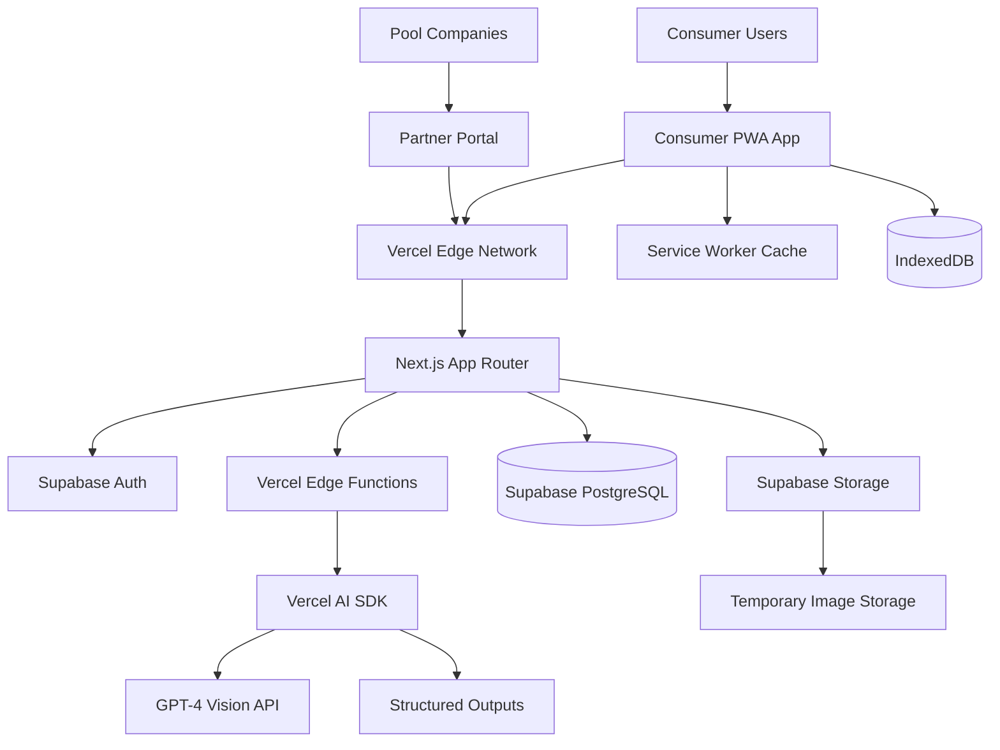

# System Architecture Design

**SplashEasy V2 - AI-Powered Water Testing Platform**

---

## 1. Architecture Overview

SplashEasy V2 follows a modern, cloud-native architecture with dual personas: a pure consumer water testing app and a separate partner business portal. The system leverages Vercel's edge computing platform with Supabase for data persistence to deliver instant AI-powered water analysis with global performance.

### 1.1 High-Level Architecture



### 1.2 Design Principles

1. **Dual Persona Architecture**: Completely separate consumer and partner experiences
2. **AI-First Interaction**: Computer vision is the primary consumer interaction paradigm
3. **Edge-Native**: Processing happens as close to users as possible
4. **Mobile-Optimized**: Every decision prioritizes mobile performance for consumers
5. **Progressive Enhancement**: Works great everywhere, exceptional on modern devices
6. **Privacy-by-Design**: Minimal data collection, secure processing, user ownership
7. **Solo-Dev Friendly**: Architecture optimized for single developer maintenance

## 2. Frontend Architecture

### 2.1 Technology Stack

```typescript
// Core Framework
Framework: Next.js 15 (App Router)
Language: TypeScript 5.6+
Build Tool: Vercel Build System (optimized)
Package Manager: npm

// Backend Services
Database: Supabase PostgreSQL
Authentication: Supabase Auth
File Storage: Supabase Storage
AI Processing: Vercel AI SDK + GPT-4 Vision

// UI/UX Stack
Component Library: shadcn/ui + Radix UI primitives
CSS Framework: Tailwind CSS 3.4+
Icons: Lucide React
Fonts: Inter (via next/font)

// PWA Features (Consumer App)
Service Worker: Workbox (Vercel integrated)
Camera Access: WebRTC getUserMedia API
Offline Storage: Local state + Supabase sync
```

### 2.2 Component Architecture

```
components/
├── ui/                 # shadcn/ui base components
│   ├── button.tsx
│   ├── card.tsx
│   ├── input.tsx
│   └── ...
├── features/          # Feature-specific components
│   ├── camera/
│   │   ├── CameraCapture.tsx
│   │   ├── StripAlignment.tsx
│   │   └── ImagePreview.tsx
│   ├── analysis/
│   │   ├── ResultsCard.tsx
│   │   ├── ConfidenceIndicator.tsx
│   │   └── DosingCalculator.tsx
│   ├── history/
│   │   ├── TestHistory.tsx
│   │   ├── TrendChart.tsx
│   │   └── ExportButton.tsx
│   └── units/
│       ├── UnitSelector.tsx
│       ├── UnitConfig.tsx
│       └── UnitCard.tsx
├── layout/            # Layout components
│   ├── Header.tsx
│   ├── Navigation.tsx
│   └── Footer.tsx
└── providers/         # Context providers
    ├── auth-provider.tsx
    ├── unit-provider.tsx
    └── theme-provider.tsx
```

### 2.3 State Management Strategy

```typescript
// Global State: React Context + useReducer
interface AppState {
  user: User | null
  selectedUnit: Unit | null
  currentTest: WaterTest | null
  analysisStatus: 'idle' | 'analyzing' | 'complete' | 'error'
}

// Server State: Vercel AI SDK built-in
const { data, isLoading, error } = useQuery({
  queryKey: ['waterTest', testId],
  queryFn: () => fetchWaterTest(testId),
})

// Local State: Component-level useState/useReducer
// Camera State: Custom hooks
const { isReady, captureImage, stream } = useCamera()
```

### 2.4 Routing Structure

```typescript
// App Router Structure
app/
├── layout.tsx                    # Root layout with providers
├── page.tsx                     # Dashboard/landing page
├── test/
│   ├── page.tsx                 # Test selection & camera
│   ├── analyze/
│   │   └── page.tsx             # Analysis results
│   └── history/
│       └── page.tsx             # Test history
├── units/
│   ├── page.tsx                 # Unit management
│   └── [unitId]/
│       ├── page.tsx             # Unit details
│       └── edit/
│           └── page.tsx         # Unit configuration
├── profile/
│   └── page.tsx                 # User profile & settings
└── api/
    ├── analyze/
    │   └── route.ts             # Computer vision endpoint
    ├── tests/
    │   └── route.ts             # CRUD for water tests
    └── units/
        └── route.ts             # Unit management API
```

## 3. Backend Architecture

### 3.1 API Layer Design

```typescript
// Next.js API Routes (App Router)
// RESTful endpoints with TypeScript schemas

// POST /api/analyze - Computer Vision Analysis
interface AnalyzeRequest {
  image: string // Base64 encoded image
  unitId: string // Associated unit
  testMethod: 'computer_vision' | 'manual'
}

interface AnalyzeResponse {
  success: boolean
  data?: {
    ph: number
    freeChlorine: number
    totalAlkalinity: number
    confidenceScore: number
    recommendations: Recommendation[]
  }
  error?: string
}

// GET /api/tests - Retrieve Test History
interface TestsResponse {
  tests: WaterTest[]
  pagination: {
    page: number
    totalPages: number
    totalCount: number
  }
}

// POST /api/units - Create/Update Units
interface UnitRequest {
  name: string
  type: 'pool' | 'spa' | 'hot_tub'
  volume: number // gallons
  sanitizerType: 'chlorine' | 'bromine' | 'salt'
}
```

### 3.2 Edge Functions Architecture

```typescript
// Vercel Edge Functions for AI Processing
// Located at: /api/analyze/route.ts

export const runtime = 'edge' // Vercel Edge Runtime
export const maxDuration = 30 // Seconds (AI processing time)

export async function POST(request: Request) {
  // 1. Input validation & authentication
  const { image, unitId } = await request.json()
  const userId = await validateAuth(request)

  // 2. Image preprocessing
  const processedImage = await optimizeImage(image)

  // 3. AI analysis via Vercel AI SDK
  const analysis = await analyzeWaterStrip({
    image: processedImage,
    model: 'gpt-4-vision-preview',
    structuredOutput: WaterTestSchema,
  })

  // 4. Business logic application
  const recommendations = calculateDosing(analysis, unitId)

  // 5. Data persistence
  await saveTestResult(userId, unitId, analysis, recommendations)

  // 6. Response with confidence scoring
  return Response.json({
    success: true,
    data: {
      ...analysis,
      recommendations,
      confidenceScore: analysis.confidence,
    },
  })
}
```

### 3.3 Database Design

```sql
-- Simplified, clean schema for V2
-- Hosted on Vercel Postgres

-- Users table (managed by Clerk)
CREATE TABLE users (
  id TEXT PRIMARY KEY,              -- Clerk user ID
  email TEXT UNIQUE NOT NULL,
  name TEXT,
  created_at TIMESTAMP DEFAULT NOW(),
  updated_at TIMESTAMP DEFAULT NOW(),
  preferences JSONB DEFAULT '{}'    -- UI preferences, defaults
);

-- Units (pools/spas)
CREATE TABLE units (
  id UUID PRIMARY KEY DEFAULT gen_random_uuid(),
  user_id TEXT NOT NULL REFERENCES users(id) ON DELETE CASCADE,
  name TEXT NOT NULL,
  type TEXT NOT NULL CHECK (type IN ('pool', 'spa', 'hot_tub')),
  volume INTEGER NOT NULL,          -- gallons
  sanitizer_type TEXT DEFAULT 'chlorine' CHECK (sanitizer_type IN ('chlorine', 'bromine', 'salt')),
  is_favorite BOOLEAN DEFAULT FALSE,
  equipment JSONB DEFAULT '{}',     -- pumps, heaters, etc.
  created_at TIMESTAMP DEFAULT NOW(),
  updated_at TIMESTAMP DEFAULT NOW()
);

-- Water tests
CREATE TABLE water_tests (
  id UUID PRIMARY KEY DEFAULT gen_random_uuid(),
  unit_id UUID NOT NULL REFERENCES units(id) ON DELETE CASCADE,
  user_id TEXT NOT NULL REFERENCES users(id) ON DELETE CASCADE,
  test_method TEXT NOT NULL CHECK (test_method IN ('computer_vision', 'manual')),

  -- Chemical readings
  ph DECIMAL(3,1) CHECK (ph >= 0 AND ph <= 14),
  free_chlorine DECIMAL(4,2) CHECK (free_chlorine >= 0),
  total_alkalinity INTEGER CHECK (total_alkalinity >= 0),
  cyanuric_acid INTEGER CHECK (cyanuric_acid >= 0),
  total_hardness INTEGER CHECK (total_hardness >= 0),
  temperature INTEGER CHECK (temperature >= 32 AND temperature <= 120),

  -- AI-specific fields
  confidence_score DECIMAL(3,2) CHECK (confidence_score >= 0 AND confidence_score <= 1),
  image_url TEXT,                   -- Temporary storage URL (24h expiry)

  -- Metadata
  notes TEXT,
  created_at TIMESTAMP DEFAULT NOW(),

  -- Indexes for performance
  CONSTRAINT valid_readings CHECK (
    ph IS NOT NULL OR
    free_chlorine IS NOT NULL OR
    total_alkalinity IS NOT NULL
  )
);

-- Recommendations (derived from tests)
CREATE TABLE recommendations (
  id UUID PRIMARY KEY DEFAULT gen_random_uuid(),
  water_test_id UUID NOT NULL REFERENCES water_tests(id) ON DELETE CASCADE,
  chemical_type TEXT NOT NULL,      -- 'ph_increaser', 'chlorine', etc.
  amount DECIMAL(5,2) NOT NULL,     -- ounces or pounds
  unit TEXT NOT NULL,               -- 'oz', 'lb', 'cups'
  priority INTEGER DEFAULT 1,       -- treatment order
  safety_notes TEXT,
  created_at TIMESTAMP DEFAULT NOW()
);

-- Indexes for performance
CREATE INDEX idx_units_user_id ON units(user_id);
CREATE INDEX idx_units_favorite ON units(user_id, is_favorite);
CREATE INDEX idx_water_tests_unit_date ON water_tests(unit_id, created_at DESC);
CREATE INDEX idx_water_tests_user_date ON water_tests(user_id, created_at DESC);
```

## 4. AI/Computer Vision Architecture

### 4.1 Computer Vision Pipeline

```typescript
// Multi-stage AI processing pipeline
class WaterStripAnalyzer {
  async analyze(imageBase64: string): Promise<WaterTestResult> {
    // Stage 1: Image validation & preprocessing
    const validatedImage = await this.validateImage(imageBase64)
    if (!validatedImage.isValid) {
      throw new Error(validatedImage.reason)
    }

    // Stage 2: Strip detection & orientation
    const stripDetection = await this.detectStrip(validatedImage.image)
    if (!stripDetection.found) {
      throw new Error('No test strip detected in image')
    }

    // Stage 3: Color analysis via GPT-4 Vision
    const colorAnalysis = await this.analyzeColors({
      image: stripDetection.croppedImage,
      stripType: 'standard_5_parameter', // pH, FC, TA, CYA, TH
      lightingConditions: stripDetection.lighting,
    })

    // Stage 4: Confidence scoring
    const confidence = this.calculateConfidence(colorAnalysis)

    // Stage 5: Result validation & error detection
    const validatedResults = this.validateResults(colorAnalysis)

    return {
      ...validatedResults,
      confidenceScore: confidence,
      processingTime: Date.now() - startTime,
    }
  }

  private async analyzeColors(params: ColorAnalysisParams): Promise<ColorAnalysis> {
    const { generateObject } = await import('ai')

    return await generateObject({
      model: 'gpt-4-vision-preview',
      messages: [
        {
          role: 'system',
          content: `You are an expert water chemistry analyzer. Analyze the test strip colors and provide accurate chemical readings. Consider lighting conditions: ${params.lightingConditions}.`,
        },
        {
          role: 'user',
          content: [
            {
              type: 'text',
              text: `Analyze this ${params.stripType} water test strip. Identify each color pad and provide precise chemical readings.`,
            },
            {
              type: 'image',
              image: params.image,
            },
          ],
        },
      ],
      schema: z.object({
        ph: z.number().min(0).max(14),
        freeChlorine: z.number().min(0).max(20),
        totalAlkalinity: z.number().min(0).max(500),
        cyanuricAcid: z.number().min(0).max(200),
        totalHardness: z.number().min(0).max(1000),
        colorConfidence: z.object({
          ph: z.number().min(0).max(1),
          freeChlorine: z.number().min(0).max(1),
          totalAlkalinity: z.number().min(0).max(1),
          overall: z.number().min(0).max(1),
        }),
        detectedIssues: z.array(z.string()).optional(),
      }),
    })
  }
}
```

### 4.2 Dosing Calculator Engine

```typescript
// Water chemistry calculation engine
class DosingCalculator {
  calculateRecommendations(
    currentReadings: WaterTestResult,
    targetRanges: ChemicalTargets,
    unitVolume: number,
    sanitizerType: SanitizerType
  ): Recommendation[] {
    const recommendations: Recommendation[] = []

    // Priority 1: pH adjustment (affects all other chemicals)
    if (this.isOutOfRange(currentReadings.ph, targetRanges.ph)) {
      recommendations.push(
        ...this.calculatePHAdjustment(
          currentReadings.ph,
          targetRanges.ph,
          unitVolume,
          currentReadings.totalAlkalinity
        )
      )
    }

    // Priority 2: Total Alkalinity (pH buffer)
    if (this.isOutOfRange(currentReadings.totalAlkalinity, targetRanges.totalAlkalinity)) {
      recommendations.push(
        ...this.calculateAlkalinityAdjustment(
          currentReadings.totalAlkalinity,
          targetRanges.totalAlkalinity,
          unitVolume
        )
      )
    }

    // Priority 3: Sanitizer levels
    if (this.isOutOfRange(currentReadings.freeChlorine, targetRanges.freeChlorine)) {
      recommendations.push(
        ...this.calculateSanitizerAdjustment(
          currentReadings.freeChlorine,
          targetRanges.freeChlorine,
          unitVolume,
          sanitizerType,
          currentReadings.cyanuricAcid
        )
      )
    }

    // Priority 4: Stabilizer (CYA) for outdoor pools
    if (
      sanitizerType === 'chlorine' &&
      this.isOutOfRange(currentReadings.cyanuricAcid, targetRanges.cyanuricAcid)
    ) {
      recommendations.push(
        ...this.calculateStabilizerAdjustment(
          currentReadings.cyanuricAcid,
          targetRanges.cyanuricAcid,
          unitVolume
        )
      )
    }

    return recommendations.sort((a, b) => a.priority - b.priority)
  }

  private calculatePHAdjustment(
    currentPH: number,
    targetRange: Range,
    volume: number,
    alkalinity: number
  ): Recommendation[] {
    const target = (targetRange.min + targetRange.max) / 2 // 7.4 for pH
    const difference = target - currentPH

    if (Math.abs(difference) < 0.1) return [] // Within acceptable range

    if (difference > 0) {
      // pH too low, add pH increaser (sodium carbonate)
      const ounces = this.calculatePHIncreaser(difference, volume, alkalinity)
      return [
        {
          chemicalType: 'ph_increaser',
          amount: ounces,
          unit: 'oz',
          priority: 1,
          reason: `pH is ${currentPH}, target is ${target.toFixed(1)}`,
          safetyNotes: 'Add slowly with pump running. Wait 4 hours before retesting.',
        },
      ]
    } else {
      // pH too high, add pH decreaser (sodium bisulfate)
      const ounces = this.calculatePHDecreaser(Math.abs(difference), volume, alkalinity)
      return [
        {
          chemicalType: 'ph_decreaser',
          amount: ounces,
          unit: 'oz',
          priority: 1,
          reason: `pH is ${currentPH}, target is ${target.toFixed(1)}`,
          safetyNotes: 'Add slowly with pump running. Wait 4 hours before retesting.',
        },
      ]
    }
  }
}
```

## 5. Security Architecture

### 5.1 Authentication & Authorization

```typescript
// Clerk integration for authentication
// middleware.ts
import { clerkMiddleware, createRouteMatcher } from '@clerk/nextjs/server'

const isProtectedRoute = createRouteMatcher([
  '/test/(.*)',
  '/units/(.*)',
  '/profile/(.*)',
  '/api/analyze',
  '/api/tests',
  '/api/units',
])

export default clerkMiddleware((auth, req) => {
  if (isProtectedRoute(req)) auth().protect()
})

// API route protection
export async function POST(request: Request) {
  const { userId } = auth()
  if (!userId) {
    return new Response('Unauthorized', { status: 401 })
  }

  // Rate limiting for AI endpoints
  const identifier = userId
  const { success } = await ratelimit.limit(identifier)
  if (!success) {
    return new Response('Rate limit exceeded', { status: 429 })
  }

  // Process request...
}
```

### 5.2 Data Protection

```typescript
// Image processing security
class SecureImageProcessor {
  async processImage(imageBase64: string): Promise<string> {
    // 1. Validate image format and size
    const validation = await this.validateImage(imageBase64)
    if (!validation.isValid) {
      throw new Error(`Invalid image: ${validation.reason}`)
    }

    // 2. Strip EXIF data for privacy
    const cleanImage = await this.removeEXIFData(imageBase64)

    // 3. Resize and optimize for AI processing
    const optimizedImage = await this.optimizeForAnalysis(cleanImage)

    // 4. Generate temporary signed URL (24h expiry)
    const tempUrl = await this.uploadTemporary(optimizedImage, '24h')

    return tempUrl
  }

  async cleanupTempImages(): Promise<void> {
    // Automated cleanup of expired temporary images
    // Runs daily via Vercel Cron Jobs
    const expiredImages = await this.getExpiredImages()
    await Promise.all(expiredImages.map(url => this.deleteImage(url)))
  }
}

// Environment variable validation
const requiredEnvVars = [
  'CLERK_SECRET_KEY',
  'POSTGRES_URL',
  'BLOB_READ_WRITE_TOKEN',
  'OPENAI_API_KEY',
] as const

function validateEnvironment() {
  const missing = requiredEnvVars.filter(key => !process.env[key])
  if (missing.length > 0) {
    throw new Error(`Missing required environment variables: ${missing.join(', ')}`)
  }
}
```

## 6. Performance Architecture

### 6.1 Frontend Optimization

```typescript
// Code splitting and lazy loading
const CameraCapture = lazy(() => import('../components/features/camera/CameraCapture'))
const ResultsChart = lazy(() => import('../components/features/analysis/ResultsChart'))

// Image optimization
import Image from 'next/image'

<Image
  src="/hero-water.jpg"
  alt="Crystal clear pool water"
  width={800}
  height={400}
  priority={true}                    // Above the fold
  placeholder="blur"                 // Loading state
  blurDataURL="data:image/svg+xml;..." // Blur placeholder
/>

// Service Worker for offline functionality
// public/sw.js (generated by Workbox)
const CACHE_NAME = 'splasheasy-v2-cache'
const OFFLINE_URLS = [
  '/',
  '/test',
  '/offline.html'
]

self.addEventListener('fetch', (event) => {
  if (event.request.url.includes('/api/analyze')) {
    // Cache AI analysis for offline review
    event.respondWith(cacheFirstStrategy(event.request))
  }
})
```

### 6.2 Edge Function Optimization

```typescript
// Vercel Edge Functions with caching
export const runtime = 'edge'
export const maxDuration = 30

// Response caching for similar images
const CACHE_TTL = 60 * 60 * 24 // 24 hours

export async function POST(request: Request) {
  const { image, unitId } = await request.json()

  // Generate cache key from image hash
  const imageHash = await generateImageHash(image)
  const cacheKey = `analysis:${imageHash}:${unitId}`

  // Check cache first
  const cached = await cache.get(cacheKey)
  if (cached) {
    return Response.json(cached, {
      headers: {
        'Cache-Control': 'public, max-age=3600',
        'X-Cache': 'HIT',
      },
    })
  }

  // Process with AI
  const result = await analyzeImage(image, unitId)

  // Cache result
  await cache.set(cacheKey, result, CACHE_TTL)

  return Response.json(result, {
    headers: {
      'Cache-Control': 'public, max-age=3600',
      'X-Cache': 'MISS',
    },
  })
}
```

### 6.3 Database Optimization

```sql
-- Performance indexes
CREATE INDEX CONCURRENTLY idx_water_tests_user_recent
ON water_tests(user_id, created_at DESC)
WHERE created_at > (NOW() - INTERVAL '30 days');

CREATE INDEX CONCURRENTLY idx_units_user_favorite
ON units(user_id, is_favorite)
WHERE is_favorite = true;

-- Materialized view for analytics
CREATE MATERIALIZED VIEW user_test_stats AS
SELECT
  user_id,
  COUNT(*) as total_tests,
  AVG(confidence_score) as avg_confidence,
  MAX(created_at) as last_test_date,
  COUNT(CASE WHEN test_method = 'computer_vision' THEN 1 END) as cv_tests
FROM water_tests
WHERE created_at > (NOW() - INTERVAL '90 days')
GROUP BY user_id;

-- Refresh materialized view hourly
CREATE OR REPLACE FUNCTION refresh_user_stats()
RETURNS void AS $$
BEGIN
  REFRESH MATERIALIZED VIEW CONCURRENTLY user_test_stats;
END;
$$ LANGUAGE plpgsql;
```

## 7. Monitoring & Observability

### 7.1 Application Monitoring

```typescript
// Vercel Analytics integration
import { Analytics } from '@vercel/analytics/react'
import { SpeedInsights } from '@vercel/speed-insights/react'

export default function RootLayout({ children }: { children: React.ReactNode }) {
  return (
    <html>
      <body>
        {children}
        <Analytics />
        <SpeedInsights />
      </body>
    </html>
  )
}

// Custom performance monitoring
class PerformanceMonitor {
  trackAIAnalysis(startTime: number, success: boolean, confidence?: number) {
    const duration = Date.now() - startTime

    // Track to Vercel Analytics
    analytics.track('ai_analysis_complete', {
      duration,
      success,
      confidence,
      timestamp: Date.now()
    })

    // Performance threshold alerts
    if (duration > 10000) {  // 10 seconds
      this.alertSlowAnalysis(duration)
    }
  }

  trackUserJourney(event: string, properties?: Record<string, any>) {
    analytics.track(event, {
      ...properties,
      timestamp: Date.now(),
      userAgent: navigator.userAgent,
      viewportWidth: window.innerWidth
    })
  }
}
```

### 7.2 Error Handling & Logging

```typescript
// Global error boundary
class ErrorBoundary extends React.Component {
  componentDidCatch(error: Error, errorInfo: ErrorInfo) {
    // Log to monitoring service
    console.error('Application Error:', error, errorInfo)

    // Track error analytics
    analytics.track('error_boundary_triggered', {
      error: error.message,
      stack: error.stack,
      componentStack: errorInfo.componentStack
    })
  }

  render() {
    if (this.state.hasError) {
      return <ErrorFallback onRetry={() => this.setState({ hasError: false })} />
    }
    return this.props.children
  }
}

// API error handling
export async function POST(request: Request) {
  try {
    // Process request...
    return Response.json({ success: true, data })
  } catch (error) {
    console.error('API Error:', error)

    // Structured error logging
    const errorLog = {
      timestamp: new Date().toISOString(),
      endpoint: request.url,
      method: request.method,
      error: error.message,
      stack: error.stack,
      userId: auth().userId
    }

    // Log to monitoring service (Vercel logs automatically)
    console.error('Structured Error:', errorLog)

    return Response.json(
      {
        success: false,
        error: 'Analysis failed',
        code: 'ANALYSIS_ERROR'
      },
      { status: 500 }
    )
  }
}
```

---

**Document Version**: 1.0  
**Last Updated**: January 2025  
**Status**: Technical Review
