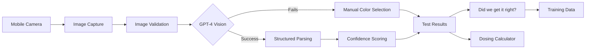

# Computer Vision Implementation Plan
**SplashEasy V2 - AI-Powered Test Strip Analysis**

---

## 1. Executive Summary

The computer vision system is the core differentiator for SplashEasy V2, transforming manual color matching into instant chemical analysis. This document outlines the beta implementation strategy using GPT-4 Vision via Vercel AI SDK, with user feedback collection to validate accuracy and guide future AI model decisions.

## 2. Vision System Architecture

### 2.1 Processing Pipeline Overview



### 2.2 Technology Stack

```typescript
// Core AI Framework (Beta Strategy)
Platform: Vercel AI SDK 5.0+
Model: GPT-4 Vision (beta testing - may switch to Gemini/Claude based on results)
Processing: Vercel Edge Functions (global edge deployment)
Structured Output: Zod schema validation
Fallback: Manual color selection when AI fails

// Image Processing
Frontend: HTML5 Canvas API + WebRTC getUserMedia
Backend: Vercel Edge Runtime with Image optimization
Storage: Supabase Storage (temporary, 24-hour expiry)
Format: JPEG/WebP with automatic compression
Supported Strips: AquaChek and Taylor (initial focus)

// Quality Assurance
Validation: Multi-stage image and result validation
Fallback: Manual entry when AI confidence < 80%
Monitoring: Confidence score tracking and error analysis
```

## 3. Implementation Strategy

### 3.1 Phase 1: Core Vision Engine (Weeks 1-2)

#### 3.1.1 Image Capture System
```typescript
// Camera integration with live preview
interface CameraConfig {
  idealWidth: 1920          // High resolution for color accuracy
  idealHeight: 1080
  facingMode: 'environment' // Back camera preferred
  flashMode: 'auto'         // Automatic flash detection
  focusMode: 'continuous'   // Continuous autofocus
}

class CameraCapture {
  private stream: MediaStream | null = null
  private canvas: HTMLCanvasElement
  private context: CanvasRenderingContext2D
  
  async initialize(): Promise<void> {
    try {
      this.stream = await navigator.mediaDevices.getUserMedia({
        video: {
          width: { ideal: 1920, min: 1280 },
          height: { ideal: 1080, min: 720 },
          facingMode: 'environment',
          focusMode: 'continuous'
        }
      })
      
      // Display live preview with strip alignment overlay
      this.setupPreview()
      this.addAlignmentGuide()
      
    } catch (error) {
      throw new CameraError('Unable to access camera', error)
    }
  }
  
  async captureImage(): Promise<string> {
    // Capture high-quality image for AI analysis
    const imageData = this.context.getImageData(0, 0, this.canvas.width, this.canvas.height)
    
    // Convert to base64 with quality optimization
    return this.canvas.toDataURL('image/jpeg', 0.95)
  }
  
  private addAlignmentGuide(): void {
    // Overlay guide showing optimal strip placement
    const overlay = document.createElement('div')
    overlay.className = 'strip-alignment-guide'
    // CSS will position this over the camera preview
  }
}
```

#### 3.1.2 Image Preprocessing
```typescript
class ImagePreprocessor {
  async optimizeForAnalysis(imageBase64: string): Promise<OptimizedImage> {
    const image = await this.loadImage(imageBase64)
    
    // 1. Detect and correct orientation
    const orientedImage = await this.correctOrientation(image)
    
    // 2. Enhance color accuracy
    const enhancedImage = await this.enhanceColors(orientedImage)
    
    // 3. Crop to strip area if detected
    const croppedImage = await this.detectAndCropStrip(enhancedImage)
    
    // 4. Normalize lighting conditions
    const normalizedImage = await this.normalizeLighting(croppedImage)
    
    return {
      processedImage: normalizedImage,
      metadata: {
        originalSize: image.size,
        processedSize: normalizedImage.size,
        detectedIssues: this.analyzeImageQuality(normalizedImage),
        lightingCondition: this.detectLightingCondition(normalizedImage)
      }
    }
  }
  
  private async detectAndCropStrip(image: HTMLImageElement): Promise<HTMLCanvasElement> {
    // Simple strip detection using edge detection
    // For MVP, we'll rely on user alignment; advanced detection in Phase 2
    return this.cropToCenter(image, 0.8) // Crop to center 80%
  }
  
  private detectLightingCondition(image: HTMLCanvasElement): LightingCondition {
    const pixels = this.getImageData(image)
    const brightness = this.calculateAverageBrightness(pixels)
    const contrast = this.calculateContrast(pixels)
    
    if (brightness < 50) return 'low_light'
    if (brightness > 200) return 'overexposed'  
    if (contrast < 30) return 'poor_contrast'
    return 'optimal'
  }
}
```

#### 3.1.3 GPT-4 Vision Integration
```typescript
class WaterStripAnalyzer {
  private aiSDK = createAI({
    model: 'gpt-4-vision-preview',
    temperature: 0.1,  // Low temperature for consistent results
    maxTokens: 1000
  })
  
  async analyzeStrip(processedImage: string, metadata: ImageMetadata): Promise<WaterTestResult> {
    const prompt = this.buildAnalysisPrompt(metadata)
    
    const result = await generateObject({
      model: this.aiSDK,
      messages: [{
        role: 'system',
        content: prompt.system
      }, {
        role: 'user',
        content: [
          {
            type: 'text', 
            text: prompt.user
          },
          {
            type: 'image',
            image: processedImage
          }
        ]
      }],
      schema: WaterTestResultSchema
    })
    
    // Validate and enhance results
    return this.validateAndEnhanceResults(result, metadata)
  }
  
  private buildAnalysisPrompt(metadata: ImageMetadata): AnalysisPrompt {
    const lightingAdjustment = this.getLightingAdjustment(metadata.lightingCondition)
    
    return {
      system: `You are an expert water chemistry analyzer specializing in test strip color analysis. 
      
      CRITICAL INSTRUCTIONS:
      - Analyze each color pad on the test strip with precision
      - Account for lighting conditions: ${metadata.lightingCondition}
      - Provide confidence scores for each measurement  
      - Flag any ambiguous or problematic readings
      - Use standard pool/spa chemistry ranges
      
      LIGHTING ADJUSTMENTS: ${lightingAdjustment}
      
      ACCURACY IS CRITICAL - These results affect water safety.`,
      
      user: `Analyze this water test strip image and provide precise chemical readings. 
      
      The strip should contain color pads for:
      1. pH (red/orange spectrum, range 6.2-8.4)
      2. Free Chlorine (clear to dark pink/purple, range 0-10 ppm)  
      3. Total Alkalinity (green spectrum, range 0-240 ppm)
      4. Cyanuric Acid (purple spectrum, range 0-100 ppm)
      5. Total Hardness (blue spectrum, range 0-400 ppm)
      
      For each parameter, provide:
      - Exact numerical reading
      - Confidence level (0-1)
      - Any concerns or notes about the reading quality`
    }
  }
}

// Zod schema for structured outputs
const WaterTestResultSchema = z.object({
  ph: z.object({
    value: z.number().min(0).max(14),
    confidence: z.number().min(0).max(1),
    notes: z.string().optional()
  }),
  freeChlorine: z.object({
    value: z.number().min(0).max(20),
    confidence: z.number().min(0).max(1), 
    notes: z.string().optional()
  }),
  totalAlkalinity: z.object({
    value: z.number().min(0).max(500),
    confidence: z.number().min(0).max(1),
    notes: z.string().optional()
  }),
  cyanuricAcid: z.object({
    value: z.number().min(0).max(200),
    confidence: z.number().min(0).max(1),
    notes: z.string().optional()
  }),
  totalHardness: z.object({
    value: z.number().min(0).max(1000),
    confidence: z.number().min(0).max(1),
    notes: z.string().optional()
  }),
  overallConfidence: z.number().min(0).max(1),
  detectedIssues: z.array(z.string()),
  recommendsRetest: z.boolean(),
  processingNotes: z.string()
})
```

### 3.2 Phase 2: Quality Assurance & Validation (Weeks 3-4)

#### 3.2.1 Multi-Layer Validation System
```typescript
class ResultValidator {
  async validateResults(results: WaterTestResult, imageMetadata: ImageMetadata): Promise<ValidationResult> {
    const validations = await Promise.all([
      this.validateChemicalRanges(results),
      this.validateConfidenceScores(results),
      this.validateChemicalRelationships(results),
      this.validateImageQuality(imageMetadata),
      this.validateConsistencyWithHistory(results)
    ])
    
    const overallScore = this.calculateOverallConfidence(validations)
    const issues = validations.flatMap(v => v.issues)
    
    return {
      isValid: overallScore >= 0.8,
      overallConfidence: overallScore,
      issues: issues,
      recommendation: this.getValidationRecommendation(overallScore, issues)
    }
  }
  
  private validateChemicalRelationships(results: WaterTestResult): ChemicalValidation {
    const issues: string[] = []
    
    // pH/Alkalinity relationship validation
    if (results.ph.value < 7.0 && results.totalAlkalinity.value > 150) {
      issues.push('Unusual pH/alkalinity combination - may indicate carbonate deposits')
    }
    
    // Free chlorine/pH relationship
    if (results.freeChlorine.value > 3.0 && results.ph.value > 8.0) {
      issues.push('High pH reduces chlorine effectiveness - prioritize pH adjustment')
    }
    
    // Cyanuric acid/chlorine relationship
    if (results.cyanuricAcid.value > 50 && results.freeChlorine.value < 2.0) {
      issues.push('High cyanuric acid may be reducing chlorine effectiveness')
    }
    
    return {
      isValid: issues.length === 0,
      confidence: issues.length === 0 ? 1.0 : 0.7,
      issues
    }
  }
}
```

#### 3.2.2 Error Handling & Fallback Strategies
```typescript
class RobustAnalysisEngine {
  async analyzeWithFallback(image: string): Promise<WaterTestResult> {
    try {
      // Primary analysis attempt
      const result = await this.primaryAnalysis(image)
      
      if (result.overallConfidence >= 0.8) {
        return result
      }
      
      // Secondary analysis with different prompt strategy
      const fallbackResult = await this.fallbackAnalysis(image, result)
      
      if (fallbackResult.overallConfidence >= 0.7) {
        return fallbackResult
      }
      
      // Final fallback: prompt for manual entry
      throw new AnalysisError('AI_CONFIDENCE_TOO_LOW', {
        primaryConfidence: result.overallConfidence,
        fallbackConfidence: fallbackResult.overallConfidence,
        recommendedAction: 'manual_entry'
      })
      
    } catch (error) {
      if (error instanceof AnalysisError) {
        throw error
      }
      
      // Unexpected error - log and provide graceful fallback
      this.logAnalysisError(error, image)
      throw new AnalysisError('ANALYSIS_FAILED', {
        originalError: error.message,
        recommendedAction: 'manual_entry_with_support'
      })
    }
  }
  
  private async fallbackAnalysis(image: string, previousResult: WaterTestResult): Promise<WaterTestResult> {
    // Use a different prompting strategy for difficult images
    const enhancedPrompt = this.buildFallbackPrompt(previousResult)
    
    return await this.analyzer.analyzeStrip(image, {
      prompt: enhancedPrompt,
      temperature: 0.2,  // Slightly higher for more variation
      retryCount: 1
    })
  }
}
```

### 3.3 Phase 3: Advanced Features (Weeks 5-8)

#### 3.3.1 Strip Type Detection
```typescript
class StripTypeDetector {
  async detectStripType(image: string): Promise<StripType> {
    // Detect different test strip brands/configurations
    const detection = await generateObject({
      model: 'gpt-4-vision-preview',
      messages: [{
        role: 'system',
        content: 'Identify the test strip type and configuration from this image.'
      }, {
        role: 'user',
        content: [
          { type: 'text', text: 'What type of water test strip is this? How many parameters does it test?' },
          { type: 'image', image }
        ]
      }],
      schema: z.object({
        stripBrand: z.enum(['aquachek', 'poolmaster', 'jed_pool', 'generic', 'unknown']),
        parameterCount: z.number().min(3).max(7),
        detectedParameters: z.array(z.enum(['ph', 'free_chlorine', 'total_alkalinity', 'cyanuric_acid', 'total_hardness', 'bromine', 'copper'])),
        confidence: z.number().min(0).max(1)
      })
    })
    
    return {
      type: detection.stripBrand,
      parameters: detection.detectedParameters,
      confidence: detection.confidence,
      analysisStrategy: this.getAnalysisStrategy(detection.stripBrand)
    }
  }
}
```

#### 3.3.2 Continuous Learning & Improvement
```typescript
class ModelPerformanceTracker {
  async trackAnalysisAccuracy(
    aiResult: WaterTestResult,
    userFeedback?: UserFeedback,
    professionalResult?: ProfessionalTestResult
  ): Promise<void> {
    
    const accuracyMetrics = {
      timestamp: new Date(),
      aiConfidence: aiResult.overallConfidence,
      userSatisfaction: userFeedback?.satisfaction,
      parameterAccuracy: this.calculateParameterAccuracy(aiResult, professionalResult),
      imageQuality: this.assessImageQuality(aiResult.imageMetadata),
      environmentalFactors: {
        lightingCondition: aiResult.imageMetadata.lightingCondition,
        deviceType: userFeedback?.deviceType,
        userExperience: userFeedback?.isFirstTime
      }
    }
    
    // Store for analysis and model improvement
    await this.storeAccuracyData(accuracyMetrics)
    
    // Alert if accuracy drops below threshold
    if (this.detectAccuracyDegradation(accuracyMetrics)) {
      await this.alertDevelopmentTeam(accuracyMetrics)
    }
  }
  
  async generateImprovementReports(): Promise<ImprovementReport> {
    const data = await this.getAccuracyData({ 
      timeframe: '30d',
      minSamples: 100
    })
    
    return {
      overallAccuracy: this.calculateOverallAccuracy(data),
      parameterPerformance: this.analyzeParameterPerformance(data),
      commonFailureModes: this.identifyFailureModes(data),
      recommendedImprovements: this.suggestImprovements(data),
      promptOptimizations: this.suggestPromptImprovements(data)
    }
  }
}
```

## 4. Testing & Quality Assurance

### 4.1 Test Strip Dataset Creation
```typescript
// Comprehensive test dataset for validation
interface TestDataset {
  controlledConditions: {
    // Lab-controlled images with known values
    perfectLighting: TestImage[]
    standardStrips: TestImage[]
    knownChemicalValues: KnownValue[]
  }
  
  realWorldConditions: {
    // User-submitted images with various conditions
    outdoorLighting: TestImage[]
    indoorLighting: TestImage[]
    poorQualityImages: TestImage[]
    edgeCases: TestImage[]
  }
  
  professionalValidation: {
    // Professional lab results for comparison
    labResults: LabResult[]
    expertAnalysis: ExpertAnalysis[]
  }
}

class TestDatasetBuilder {
  async buildComprehensiveDataset(): Promise<TestDataset> {
    // Phase 1: Create controlled test images
    const controlledData = await this.createControlledDataset({
      stripTypes: ['5-parameter', '7-parameter'],
      chemicalRanges: this.getStandardRanges(),
      lightingConditions: ['optimal', 'bright', 'dim'],
      imageQuality: ['high', 'medium']
    })
    
    // Phase 2: Collect real-world data
    const realWorldData = await this.collectUserImages({
      consentRequired: true,
      anonymization: true,
      qualityThreshold: 0.3
    })
    
    // Phase 3: Professional validation
    const validationData = await this.getProfessionalValidation({
      sampleSize: 200,
      labPartners: ['AquaLab', 'WaterTech'],
      expertReviewers: 3
    })
    
    return {
      controlledConditions: controlledData,
      realWorldConditions: realWorldData,
      professionalValidation: validationData
    }
  }
}
```

### 4.2 Accuracy Benchmarking
```typescript
class AccuracyBenchmark {
  async runComprehensiveBenchmark(): Promise<BenchmarkReport> {
    const benchmarks = await Promise.all([
      this.benchmarkParameterAccuracy(),
      this.benchmarkLightingRobustness(), 
      this.benchmarkProcessingSpeed(),
      this.benchmarkConfidenceCalibration(),
      this.benchmarkEdgeCaseHandling()
    ])
    
    return {
      overallScore: this.calculateOverallScore(benchmarks),
      parameterAccuracy: benchmarks[0],
      robustnessScore: benchmarks[1],
      performanceScore: benchmarks[2],
      confidenceAlignment: benchmarks[3],
      edgeCaseHandling: benchmarks[4],
      recommendations: this.generateRecommendations(benchmarks)
    }
  }
  
  async benchmarkParameterAccuracy(): Promise<ParameterAccuracy> {
    // Test accuracy for each chemical parameter
    const testCases = await this.loadTestCases()
    const results = []
    
    for (const testCase of testCases) {
      const aiResult = await this.analyzer.analyzeStrip(testCase.image)
      const accuracy = this.calculateAccuracy(aiResult, testCase.knownValues)
      results.push({
        parameter: testCase.parameter,
        accuracy,
        absoluteError: this.calculateAbsoluteError(aiResult, testCase.knownValues),
        confidence: aiResult.overallConfidence
      })
    }
    
    return {
      pH: this.aggregateResults(results, 'ph'),
      freeChlorine: this.aggregateResults(results, 'free_chlorine'),
      totalAlkalinity: this.aggregateResults(results, 'total_alkalinity'),
      overall: this.calculateOverallAccuracy(results)
    }
  }
}
```

## 5. Deployment & Monitoring

### 5.1 Production Deployment Strategy
```typescript
// Gradual rollout with feature flags
class VisionDeploymentManager {
  async deployWithCanaryRelease(): Promise<void> {
    // Phase 1: 5% of users get AI analysis
    await this.enableFeatureFlag('computer_vision_analysis', {
      percentage: 5,
      criteria: ['beta_users', 'high_engagement']
    })
    
    // Monitor key metrics
    const metrics = await this.monitorCanaryMetrics({
      duration: '48h',
      successThreshold: 0.95,
      errorThreshold: 0.02
    })
    
    if (metrics.success) {
      // Phase 2: 25% rollout
      await this.expandFeatureFlag('computer_vision_analysis', {
        percentage: 25,
        criteria: ['all_users']
      })
    }
  }
  
  async setupMonitoringDashboard(): Promise<void> {
    // Real-time monitoring of AI performance
    const dashboard = await this.createDashboard({
      metrics: [
        'ai_analysis_success_rate',
        'average_confidence_score',
        'processing_time_p95',
        'user_satisfaction_score',
        'fallback_to_manual_rate',
        'api_cost_per_analysis'
      ],
      alerts: [
        { metric: 'success_rate', threshold: 0.9, action: 'page_oncall' },
        { metric: 'confidence_score', threshold: 0.8, action: 'alert_team' },
        { metric: 'processing_time', threshold: 10, action: 'auto_scale' }
      ]
    })
  }
}
```

### 5.2 Cost Management & Optimization
```typescript
class AIResourceManager {
  async optimizeAICosts(): Promise<CostOptimization> {
    // Monitor API usage and implement cost controls
    const usage = await this.getAPIUsage({ period: '7d' })
    
    const optimizations = {
      // Cache similar images to reduce API calls
      imageCache: await this.implementImageCaching({
        hashAlgorithm: 'perceptual',
        cacheDuration: '24h',
        maxCacheSize: '1GB'
      }),
      
      // Batch processing for non-real-time analysis
      batchProcessing: await this.enableBatchMode({
        batchSize: 10,
        maxWaitTime: '30s',
        eligibleUsers: ['bulk_testers']
      }),
      
      // Rate limiting to prevent abuse
      rateLimiting: await this.implementRateLimits({
        perUser: '20/hour',
        perIP: '50/hour',
        premium: 'unlimited'
      })
    }
    
    return {
      projectedSavings: this.calculateSavings(optimizations),
      implementation: optimizations,
      monitoringAlerts: this.setupCostAlerts()
    }
  }
}
```

## 6. Success Metrics & KPIs

### 6.1 Technical Metrics
- **Accuracy**: >95% correlation with professional lab results
- **Speed**: <3 seconds average processing time  
- **Reliability**: >99% successful analysis completion
- **Confidence Calibration**: Confidence scores align with actual accuracy

### 6.2 User Experience Metrics
- **Adoption Rate**: >70% of users prefer AI analysis over manual
- **Success Rate**: >90% of first-time users complete successful analysis
- **Satisfaction**: >4.5/5 user satisfaction with AI results
- **Retention**: Computer vision users have 2x higher retention

### 6.3 Business Metrics  
- **Cost Efficiency**: <$0.10 per analysis (including API + infrastructure)
- **Premium Conversion**: 40% of AI users upgrade to premium
- **Support Reduction**: 50% reduction in water chemistry support tickets

## 7. Risk Mitigation

### 7.1 Technical Risks
- **AI Service Outage**: Graceful fallback to manual entry with saved preferences
- **Accuracy Degradation**: Real-time monitoring with automatic fallback thresholds
- **Cost Overruns**: Usage caps and intelligent caching to control API costs

### 7.2 User Safety Risks
- **Incorrect Dosing**: Conservative recommendations with safety margins
- **Overconfidence**: Clear confidence scoring and uncertainty communication  
- **Chemical Safety**: Prominent safety warnings and professional consultation prompts

---

**Document Version**: 1.0  
**Last Updated**: January 2025  
**Status**: Implementation Ready